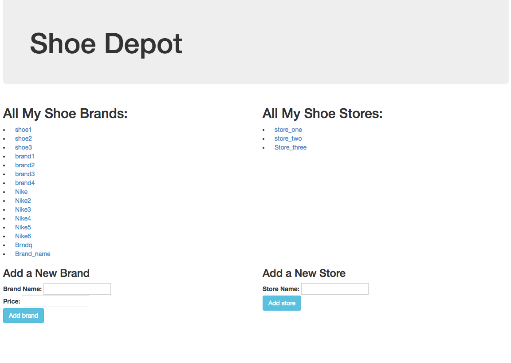

# SHOE DEPOT

Shoe Depot is a web app that allows you the ability to track shoes and shoe stores, essentially. Add shoes and add shoe stores. Then you will be able to set where shoes are sold and/or what stores sell which shoes.



### Prerequisites

Web browser with ES6 compatibility
Examples: Chrome, Safari

Ruby
Bundler

### Installing

Clone this repo by typing into the terminal:
```
$ git clone https://github.com/jennifer-kinsey/shoe-depot.git
```
In a new terminal tab:
```
$ postgres
```
Navigate to this project directory in the terminal. Then in a new tab type:
```
$ rake db:schema:load
$ rake db:test:prepare
```

In the first terminal window type command:
```
$ruby app.rb
```
Sinatra will now make this project available in your browser by going to localhost:4567.

## Built With

* Ruby
* Sinatra
* HTML
* CSS
* Bootstrap https://getbootstrap.com/
* ES6
* ActiveRecord

## Authors

* Jennifer Kinsey

## License

MIT License

Copyright (c) Jennifer Kinsey

Permission is hereby granted, free of charge, to any person obtaining a copy
of this software and associated documentation files (the "Software"), to deal
in the Software without restriction, including without limitation the rights
to use, copy, modify, merge, publish, distribute, sublicense, and/or sell
copies of the Software, and to permit persons to whom the Software is
furnished to do so, subject to the following conditions:

The above copyright notice and this permission notice shall be included in all
copies or substantial portions of the Software.

THE SOFTWARE IS PROVIDED "AS IS", WITHOUT WARRANTY OF ANY KIND, EXPRESS OR
IMPLIED, INCLUDING BUT NOT LIMITED TO THE WARRANTIES OF MERCHANTABILITY,
FITNESS FOR A PARTICULAR PURPOSE AND NONINFRINGEMENT. IN NO EVENT SHALL THE
AUTHORS OR COPYRIGHT HOLDERS BE LIABLE FOR ANY CLAIM, DAMAGES OR OTHER
LIABILITY, WHETHER IN AN ACTION OF CONTRACT, TORT OR OTHERWISE, ARISING FROM,
OUT OF OR IN CONNECTION WITH THE SOFTWARE OR THE USE OR OTHER DEALINGS IN THE
SOFTWARE.
